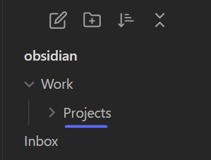

# Folder Notes

Adds Folder Notes to the default file tree.

---

This plugin does one thing and one thing only:

If you click a folder in the file tree and there is a note inside that folder with the same name as that folder, it will open the note instead of expanding the folder.

For example, if you click on the word "Projects", and there is a file inside that folder called "Projects.md", that file will open.

